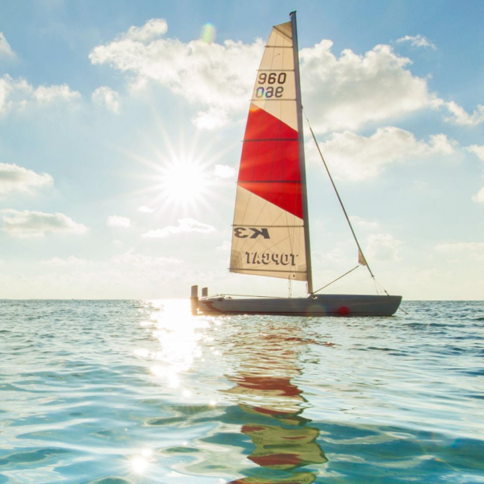

<!DOCTYPE html>
<html lang="zh-CN">
<head>
  <meta charset="UTF-8" />
  <meta name="viewport" content="width=device-width, initial-scale=1.0" />
  <title>Yuanyang Liu | Home</title>
  <meta name="description" content="Yuanyang Liu's personal homepage: embodied AI, robot manipulation, underwater grasping, and robotic systems." />
  <link rel="stylesheet" href="style.css" />
</head>

<body>
  <header class="site-header">
    

      <a href="index.html" class="logo">Home</a>

      <nav class="nav-links">
        <a href="index.html" data-i18n="nav_home">首页</a>
        <a href="#research" data-i18n="nav_research">研究</a>
        <a href="#projects" data-i18n="nav_projects">项目</a>
        <a href="publications.html" data-i18n="nav_publications">论文</a>
        <a href="notes.html" data-i18n="nav_notes">笔记</a>
        <a href="cv.html" data-i18n="nav_cv">CV</a>
        <a href="#contact" data-i18n="nav_contact">联系</a>
      </nav>

      <button id="langToggle" class="lang-toggle">English</button>
    

  </header>

  <main>
    <section class="hero">
      

        

          

            Embodied AI · Robot Manipulation · Underwater Grasping
          

          <h1 data-i18n="hero_title">
            机器人操作与水下抓取
          </h1>

          

            我正在学习和搭建真实机器人操作系统，关注动态目标感知、抗扰抓取和闭环执行。当前重点是先跑通一个可靠的最小闭环，再逐步扩展到扰动、恢复和泛化问题。
          

          

            <a href="#projects" class="button primary" data-i18n="hero_button_projects">查看项目</a>
            <a href="cv.html" class="button secondary" data-i18n="hero_button_cv">查看 CV</a>
          

          

            

              身份
              研究生
            

            

              方向
              Robot Manipulation
            

            

              邮箱
              2283523323@qq.com
            

          

        

        <aside class="profile-card">
          

            
          

          <h2>Yuanyang Liu</h2>
          

            Embodied AI / Robot Manipulation
          

          

            Building small, testable robotic manipulation systems.
          

          

            <a href="mailto:2283523323@qq.com">Email</a>
            <a href="https://github.com/Yuanyang0806" target="_blank" rel="noopener">GitHub</a>
          

        </aside>
      

    </section>

    <section id="about" class="section">
      

        

          
About

          <h2 data-i18n="about_title">关于我</h2>
        

        

          

            我关注具身智能与机器人操作，正在围绕视觉定位、机械臂控制、抓取执行和实验复盘搭建自己的研究系统。
          

          

            目前的主要任务是把 D435i / 双目视觉、SO101 机械臂和水下/类水下抓取实验串成一个可运行的闭环。
          

          

            我希望后续工作能更清楚地回答：扰动从哪里来，系统何时失败，怎样恢复，以及哪些实验指标真正说明问题。
          

        

      

    </section>

    <section id="research" class="section muted">
      

        
Research

        <h2 data-i18n="research_title">研究方向</h2>

        

          <a class="card link-card" href="projects/underwater-localization.html">
            <h3 data-i18n="research_1_title">水下机器人操作</h3>
            
围绕水下/类水下抓取，研究视觉定位、抓取执行和实验系统搭建。

            查看详情 →
          </a>

          <a class="card link-card" href="projects/planar-disturbance.html">
            <h3 data-i18n="research_2_title">动态目标感知</h3>
            
关注受扰动目标的检测、跟踪、状态估计和面向抓取的反馈更新。

            查看详情 →
          </a>

          <a class="card link-card" href="projects/planar-disturbance.html">
            <h3 data-i18n="research_3_title">抗扰抓取</h3>
            
分析目标扰动、动作偏差和失败恢复，不只看成功率，也看失败类型。

            查看详情 →
          </a>

          <a class="card link-card" href="projects/sim-to-real.html">
            <h3 data-i18n="research_4_title">策略学习</h3>
            
学习 imitation learning、policy learning、diffusion policy 和 VLA 在操作任务中的用法。

            查看详情 →
          </a>
        

      

    </section>

    <section id="projects" class="section">
      

        
Projects

        <h2 data-i18n="projects_title">项目</h2>

        

          <a class="project-card link-card" href="projects/d435i-so101.html">
            
System

            <h3>D435i + SO101 Visual Grasping System</h3>
            

              一个最小闭环视觉抓取系统：目标检测、坐标标定、机械臂执行、结果记录。
            

            查看详情 →
          </a>

          <a class="project-card link-card" href="projects/underwater-localization.html">
            
Vision

            <h3>Underwater Target Localization</h3>
            

              面向水下/类水下环境的目标定位，重点关注折射影响、深度不可靠和双目 RGB 替代方案。
            

            查看详情 →
          </a>

          <a class="project-card link-card" href="projects/planar-disturbance.html">
            
Experiment

            <h3>Planar Disturbance Platform</h3>
            

              用二轴平面扰动平台研究目标运动、抓取时机、反馈修正和恢复策略。
            

            查看详情 →
          </a>

          <a class="project-card link-card" href="projects/sim-to-real.html">
            
Learning

            <h3>Sim-to-Real Manipulation Pipeline</h3>
            

              预留方向：用于整理仿真、数据采集、策略学习和真实机器人验证的实验流程。
            

            查看详情 →
          </a>
        

      

    </section>

    <section id="notes-preview" class="section muted">
      

        
Notes

        <h2 data-i18n="notes_title">技术笔记</h2>

        

          <a class="card link-card" href="notes/system-setup.html">
            <h3 data-i18n="notes_1_title">系统搭建</h3>
            
相机、机械臂、ROS 2、LeRobot、标定和调试记录。

            查看详情 →
          </a>

          <a class="card link-card" href="notes/paper-reading.html">
            <h3 data-i18n="notes_2_title">论文阅读</h3>
            
manipulation、VLA、diffusion policy、sim-to-real 等阅读笔记。

            查看详情 →
          </a>

          <a class="card link-card" href="notes/experiment-review.html">
            <h3 data-i18n="notes_3_title">实验复盘</h3>
            
失败案例、误差来源、指标设计、消融和可视化。

            查看详情 →
          </a>

          <a class="card link-card" href="notes.html">
            <h3 data-i18n="notes_4_title">全部笔记</h3>
            
进入笔记索引页，后续可以持续添加 Obsidian Markdown 内容。

            查看详情 →
          </a>
        

      

    </section>

    <section id="cv-preview" class="section">
      

        

          
CV

          <h2 data-i18n="cv_title">简历</h2>
          

            这里放教育经历、技能、项目、论文和奖项。当前先作为网页简历，之后可以再上传 PDF 版本。
          

        

        

          <a href="cv.html" data-i18n="cv_button_web">查看网页 CV</a>
          <a href="cv.html" data-i18n="cv_button_pdf">PDF CV 待上传</a>
        

      

    </section>

    <section id="contact" class="section contact-section">
      

        

          
Contact

          <h2 data-i18n="contact_title">联系</h2>
          

            欢迎就机器人操作、水下抓取、具身智能和真实机器人系统交流。
          

        

        

          <a href="mailto:2283523323@qq.com">2283523323@qq.com</a>
          <a href="https://github.com/Yuanyang0806" target="_blank" rel="noopener">github.com/Yuanyang0806</a>
        

      

    </section>
  </main>

  <footer class="footer">
    

      © 2026 Yuanyang Liu
      Built with GitHub Pages
    

  </footer>

  
</body>
</html>
